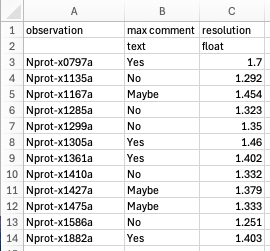
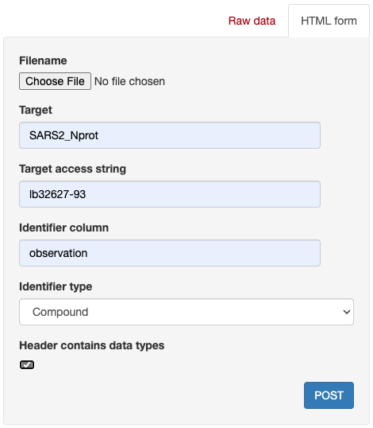

# Uploading assay measurements or computed scores

Fragalysis supports annotation of experimental data with text or numeric scores that are linked either to compound codes or observation short codes.

```{warning}
Do not upload any assay data to a public target that is confidential! Measurements against compounds that do not (yet) have structures will still be accessible to authorised API users.
```

## Creating the assay data CSV

Create a CSV with:

- one identifier column, containing either compound codes or observation short codes
- as many text/numeric columns as you want
- The data type of columns can optionally be specified by an additional row containing `text`, `int`, or `float`



Please note that CDD data can be exported as a CSV and often uploading with minimal manual modification.

## Uploading

- Log in and open your target of interest
- Select `Assay data upload` from the menu
- Complete the form:



## Modifying data type of existing data column

Use the `/api/activity_data_curation/` endpoint to change data types of previously uploaded scores
