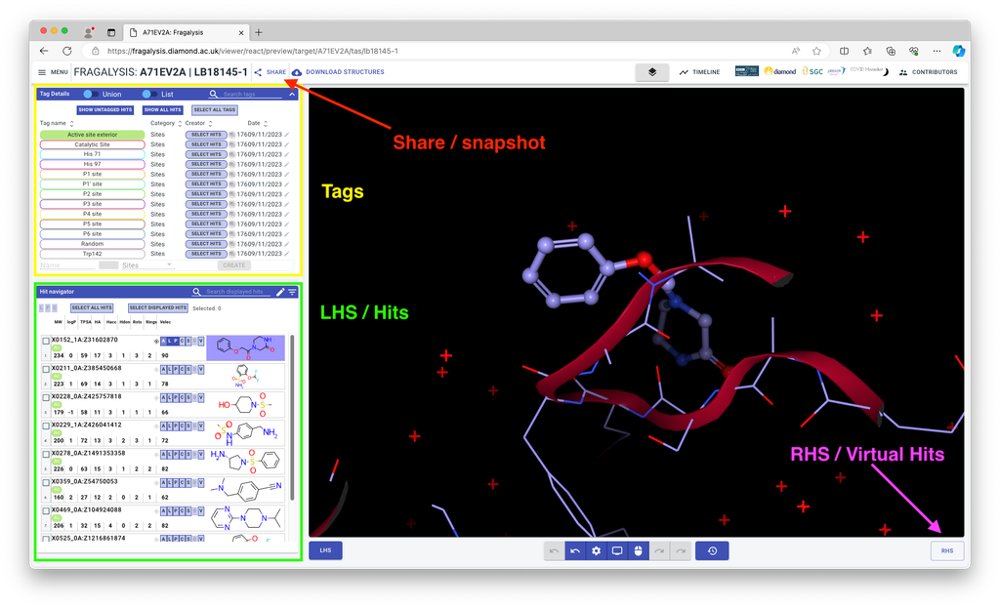

# Fragalysis

This page gives a brief introduction to the Fragalysis app, see the full documentation tree [below](#documentation-pages).

## The Fragalysis "viewer" interface



- **Share/snapshot** this allows you to create and share a permanent link to your exact Fragalysis state
- **Tags** This is how you can control which hits are visible by sites and other categories
- **LHS / Hits** Here you can navigate all the hits and add visualisations to them (The Tags panel also belongs to the LHS)
- The visualisation buttons are shared also with virtual hits (RHS) and work as follows:
   - **A**ll : show ligand in (CPK), protein side chains (lines), and interactions.
   - **L**igand: Ligand (CPK)
   - **P**rotein: Protein side chains (lines)
   - Intera**c**tions: Interactions
   - **S**urface: Electrostatic surface of the protein
   - Electron **D**ensity: Experimental electron density
   - **V**ectors: Possible vectors for elaboration
- Controlling the 3D (NGL) viewer:
   - Rotate: left click and drag
   - Pan: right click and drag
   - Zoom: scroll
   - 3D Slice: hold shift + scroll

See also the [LHS documentation page](lhs).

## Documentation Pages

### Experimental Structures (LHS)

```{toctree}
:maxdepth: 1
lhs.md
tags.md
urls.md
```

### Computed Structures (RHS)

```{toctree}
:maxdepth: 1
rhs.md
rhs_upload.md
```