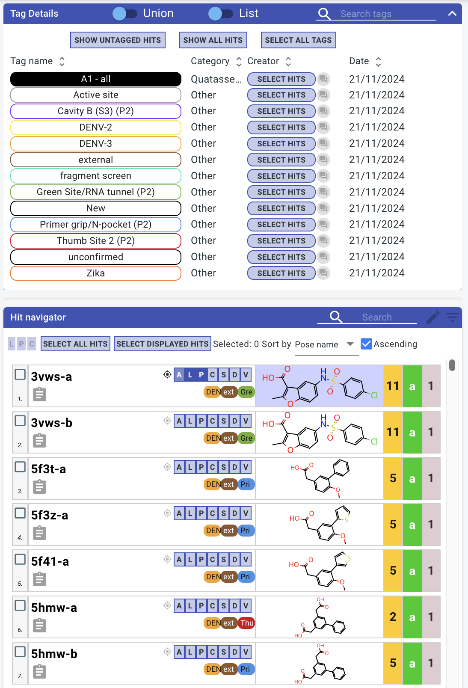
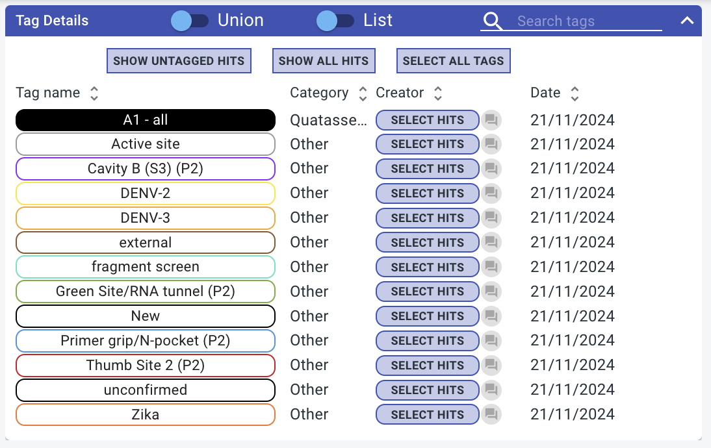
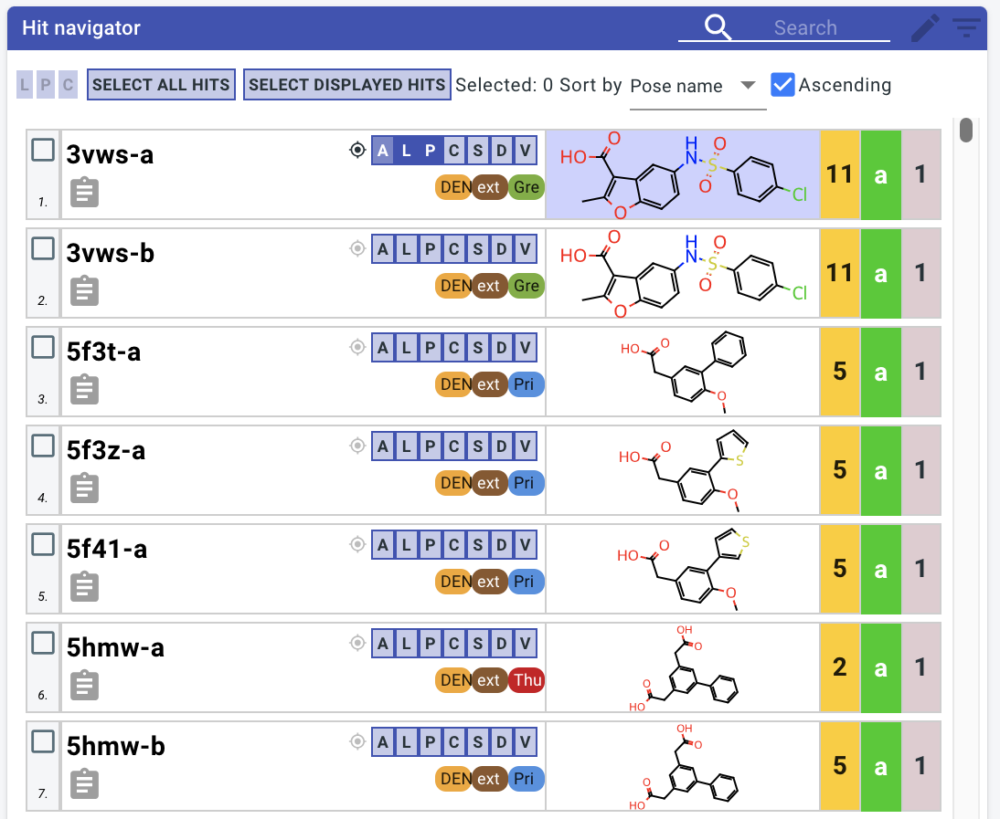
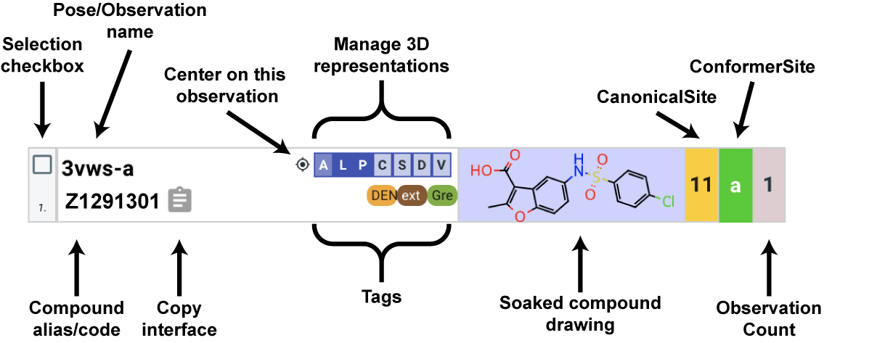
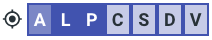
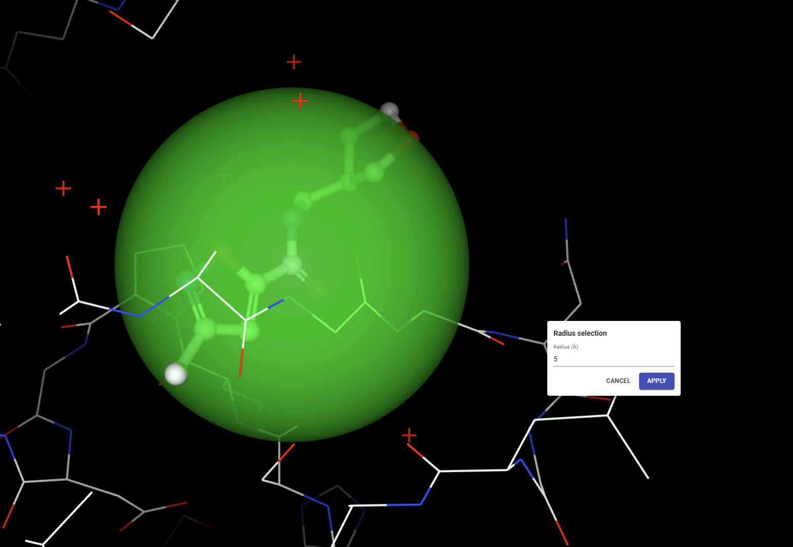
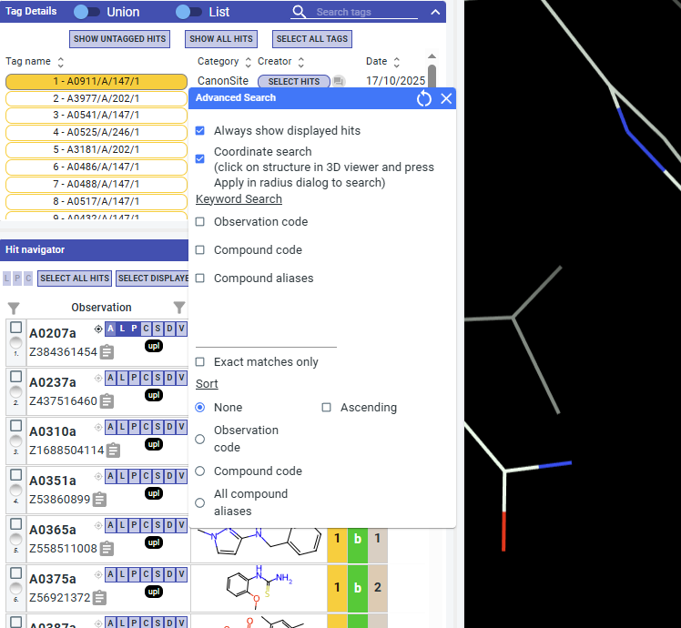

# Browsing Experimental (LHS) data

The left-hand-side (LHS) user interface of Fragalysis allows you to select experimental data for display, download, and computation.

There are two panels:

- [Tag Details](#tag-details)
- [Hit navigator](#hit-navigator)
- [Geometric filtering](#geometric-filtering)

## Tag Details

All tags assigned to left-hand side data can be managed in this panel.

This section details how tags can be used to filter experimental data. To add and edit tags see the [Tagging/curating experimental (LHS) data](tags) page.

### Selecting tag(s)

Select tags to show datasets assigned to that tag in the [Hit navigator](#hit-navigator). The union / intersection toggle at the top of the page can be used to determine the behaviour when multiple tags are selected:

- **Union**: Display datasets that are tagged with **at least one** of the selected tags
- **Intersection**: Display datasets that are tagged with **all** of the selected tags

### Show all hits

The **SHOW ALL HITS** button overrides the tag selection and shows datasets regardless of tag

### Select all tags

The **SELECT ALL TAGS** button selects all tags

### Select hits belonging to a tag

To select (activate checkboxes) in the hit navigator for all datasets belonging to a specific tag use the **SELECT HITS** buttons next to each tag.

## Hit navigator

### LHS "poses" and "observations"

Ligands from experimental datasets are known as **observations** are grouped into **poses**. **Poses** are named after and take their behaviour from their **main observation**.

**Poses** and **observations** have the following interface:

### Display data in the 3D viewer

The **[A][L][P][C][S][D][V]** buttons can be used to activate various representations of the observation in the 3D NGL viewer:

- **[A]**: shortcut to activate **[L][P][C]**
- **[L]**: **L**igand (ball and stick)
- **[P]**: **P**rotein sidechains (lines)
- **[C]**: Intera**C**tions
- **[S]**: **S**urface (coloured by electrostatics)
- **[D]**: Electron **D**ensity maps
- **[V]**: Expansion **V**ectors

### What decides which hits are shown?

The hit navigator follows these key rules to determine which datasets are shown:

1. All datasets displayed in the 3d viewer are shown
1. Datasets from active tags are shown
1. If a search string is present, only observations matching that string are shown

### Searching for specific hits

The search bar can be used to search for specific hits:

Your search query will be matched against the following fields:

- Observation shortcode
- Compound aliases
- Compound ID

This can be customised by clicking on the magnifying glass icon.

See also [Creating direct URLs to specific views](urls.md)

## Geometric filtering

Geometric filtering allows you to limit hits based on their position in 3D space. When you click any structure in the NGL Viewer, a green semi-transparent sphere will appear. After clicking **Apply** in the **Radius selection** dialog, only hits that intersect with the sphere will be shown in the hit navigator.

This feature is **ON** by default and can be toggled in the Advanced Search dialog. If you turn it off, any existing geometric filtering is cleared and no spatial filtering will be applied.

