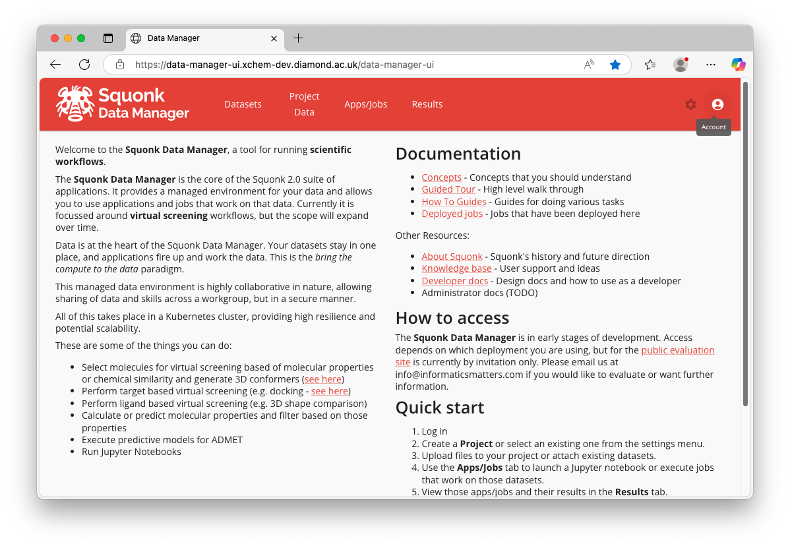
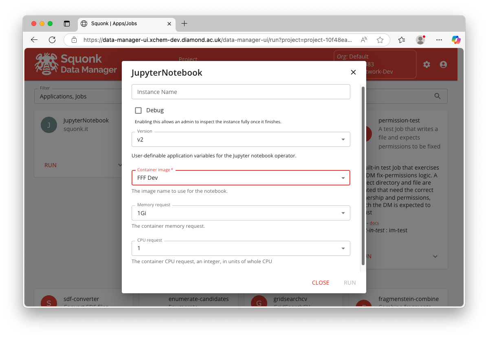
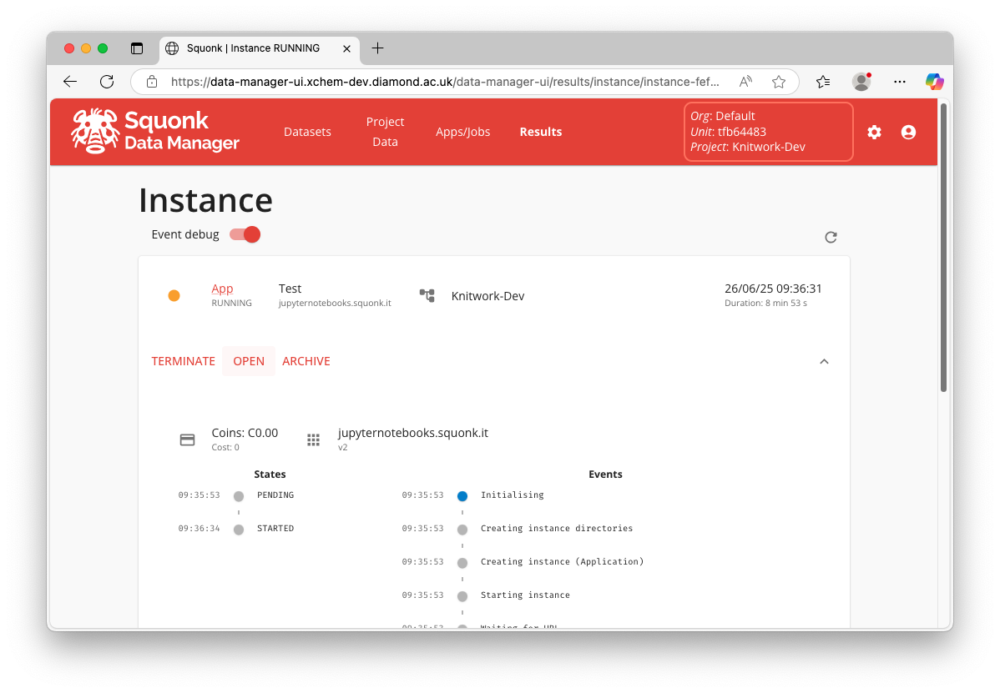
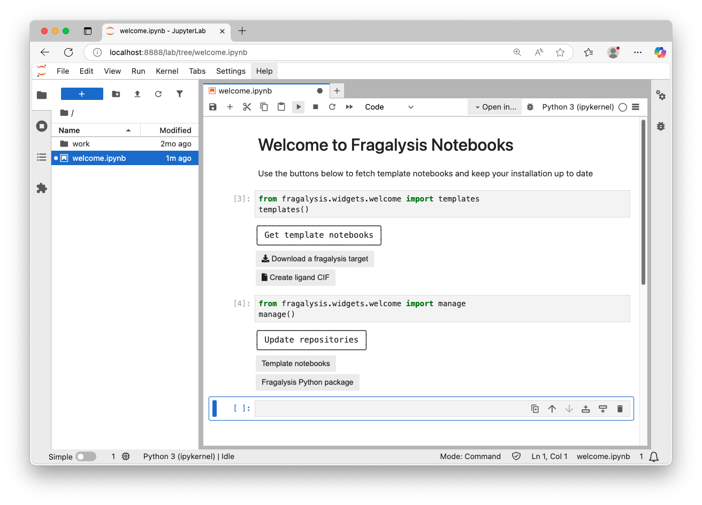

# Jupyter Notebooks in Fragalysis

Fragalysis offers simplified access to computational resources via JupyterLab. JupyterLab provides a graphical user interface to run Python code via interactive notebooks, terminals, and scripts.

## Starting a Notebook app

1. Go to the [Squonk Data Manager](https://data-manager-ui.xchem-dev.diamond.ac.uk/data-manager-ui/)

2. Log in via CAS (top right button)



3. Go to the `Apps/Jobs` page (top middle button)

4. Find the `JupyterNotebook` card and click `RUN`

5. Configure the job. All the tutorials in this page use the `FFF Dev` container image, otherwise the default settings are appropriate unless specified.



6. Click run, and wait for the app to initialise. A button `OPEN` will appear



7. Familiarise yourself with the JupyterLab deployment in the [next section](#general-tips)

## General tips



### Using Notebooks and templates

When you first launch a notebook app with the `FFF Dev` container image you will only see the `welcome.ipynb` notebook in the left-hand-side file navigator. When you open this notebook you will see two code cells. Clicking the play button in the top menu bar will allow you to execute them and create two interfaces.

The *Get template notebooks* interface offers buttons to fetch template notebooks from the template repository. **Do note that this would overwrite any changes you have made to previously copied template instances**

The *Update repositories* interface offers buttons to update both the template notebook repository and fragalysis python package to it's latest version. Use these buttons if you feel that your installation is stale and does not represent what's shown in this documentation.

### Moving data

You can use the file navigator to move files around and create folders. You can also drag and drop files from your local computer to upload data, and right click to download files to your computer.

### Installing extra packages

Within this JupyterLab app you have full access to a command line and can manage your Python package installations via `pip`, e.g.:

```bash
pip install --upgrade --user syndirella
```

### Developing python code

If you wish to work on a python package from a github repository you can clone and install it as follows:

```bash
git clone https://github.com/xchem/fragalysis
cd fragalysis
pip install --user -e .
```
