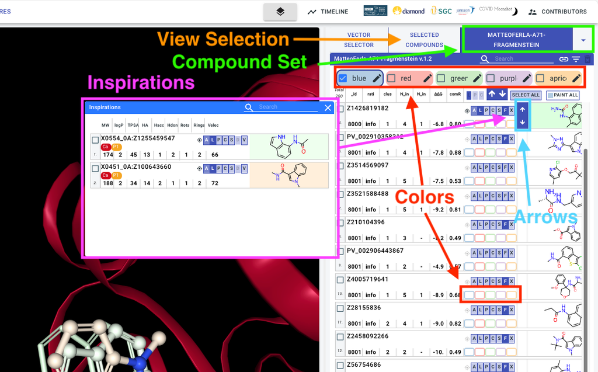
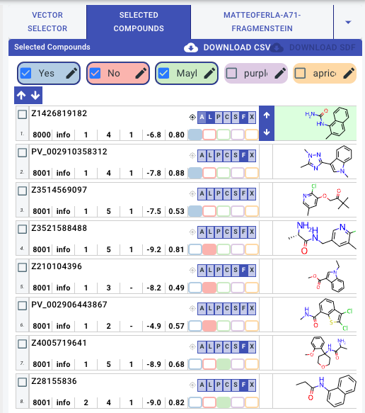

# Browsing virtual compound sets (RHS)

## Overview of the RHS interface

The RHS is where follow-up designs and their virtual hits are navigated:

### Compound set

Follow-up designs are uploaded as compound sets and selected via the highlighted dropdown

You can use the search and filter functionality to navigate the set

### Colors

You can paint compounds with colours that can be renamed, i.e. “Yes”, “No”, “Maybe”

These labels will be assigned to compounds in your session and can be downloaded as a CSV in the “selected compounds” tab

### Inspirations

The “F” button on each compound can be used to bring up a modal with the experimental hits used as inspiration for the compound design

The same LHS visualisation buttons are available to superimpose the inspiration hit with the follow-up design

### Arrows

Use these arrows to quickly apply the current visualisations to adjacent compounds

This works best when inspirations modal is open, and the inspiration hits and current compound are shown as ligands

## How to curate/select compounds in Fragalysis

Once you have ‘painted’ compounds from different sets they can be viewed together in the “selected compounds” tab

Once the selection is finalised, use the “Download CSV” button to download a CSV of your selections, and share this file with those progressing the order.
