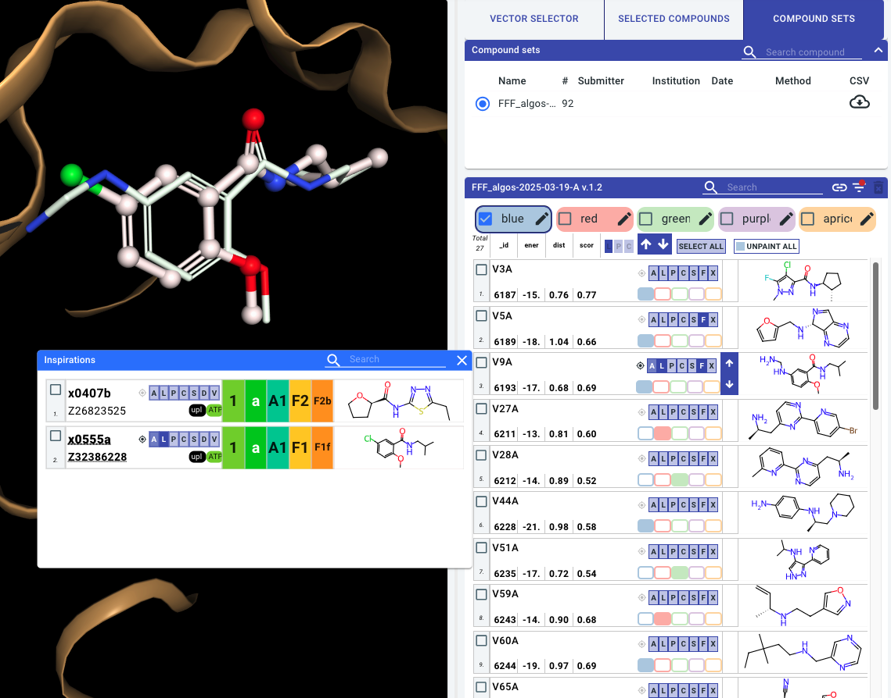
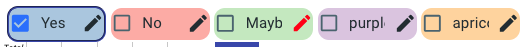
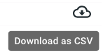
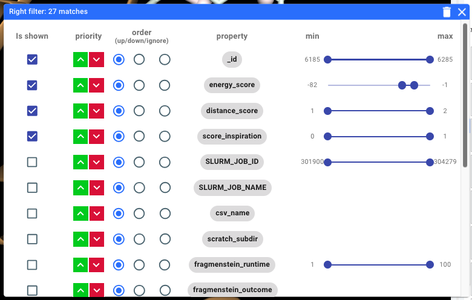

# Browsing virtual compound sets (RHS)

## Overview of the RHS interface

The right hand side (RHS) is where follow-up designs and their virtual hits are navigated:



### Compound Sets

Follow-up designs are grouped into **compound sets**, corresponding to each SDF that was uploaded (See [Uploading compound sets to the RHS](rhs_upload.md)).

### Inspirations

The `F` button on each compound can be used to bring up a modal with the experimental hits used as **inspirations** / references for the compound design. The same LHS visualisation buttons are available to superimpose the inspiration hit with the follow-up design. When an experimental dataset is displayed, all virtual designs referencing that ligand will have their `F` icon active. 

### Colours / painting

You can **paint** compounds with colours that can be renamed, i.e. “Yes”, “No”, “Maybe”:



These labels will be assigned to compounds in your session and can be downloaded as a CSV in the “selected compounds” tab

```{warning}
The state of the Fragalyis RHS does not persist when you refresh or otherwise leave the page. To export a copy of your curations remember to download a CSV:


```

### Arrows

Use these arrows to quickly apply the current visualisations to adjacent compounds

This works best when inspirations modal is open, and the inspiration hits and current compound are shown as ligands

### Sorting and filtering

Clicking on the **filter**  icon allows you to sort and filter the compounds by properties present in the uploaded set. Typically you will find scores such as *energy_score* representing computed binding energy, *distance_score* representing RMS distance to the fragment inspirations, and *score_inspiration* which may indicate how well the fragments references have been recapitulated:



## How to curate/select compounds in Fragalysis

Once you have [painted](#colours-painting) compounds you can export a CSV which can be used to share your curations/review with others:


Compounds from different sets they can be viewed together in the “selected compounds” tab.

