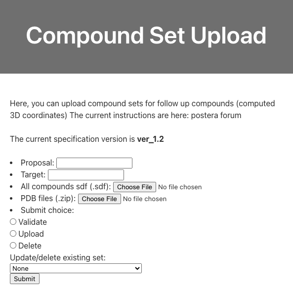

# Uploading compound sets to the RHS

In order to disseminate non-experimental structures/ligands with Fragalysis, they can be uploaded using the "RHS upload" option in the "Hamburger menu", which takes you to the `viewer/upload_cset` endpoint:



## Supported data format

To upload a compound set to the RHS of Fragalysis an SD file (SDF) must be prepared. 

### Header molecule

Fragalysis requires a **header** molecule that defines properties for the whole compound set. The molecule and coordinates of the header molecule are completely ignored, however there are required properties:


|        Property         |                     Value                     |
|-------------------------|-----------------------------------------------|
| `_Name`                 | `ver_1.2`                                     |
| `ref_url`               | Reference URL for the algorithm / dataset     |
| `submitter_name`        | Compound set submitter's name                 |
| `submitter_email`       | Compound set submitter's email                |
| `submitter_institution` | Compound set submitter's institution          |
| `generation_date`       | Date associated with the data (ISO 8601)      |
| `method`                | Algorithm / method name for this compound set |


Additionally, if you want to include extra text or numerical properties for ligands in this set you will have to include that property in the header as well with a description value. For example if you want to include a `energy_score` property with each ligand you will need to include this as a property on the header as well, with a text description:

|        Property         |                     Value                     |
|-------------------------|-----------------------------------------------|
| `energy_score`                 | `Computed binding energy (kcal/mol)`|

An example header molecule is provided [below](#example-header).

### Ligands

The required properties for each **non-header** molecule are different:


|  Property  |                                                Value                                                 |
|------------|------------------------------------------------------------------------------------------------------|
| `_Name`    | compound name                                                                                        |
| `ref_pdb`  | Reference protein (Fragalysis observation short-code, e.g. A0310a)                                   |
| `ref_mols` | Reference datasets that inspired this molecule/pose (Fragalysis observation short-code, e.g. A0310a) |

### Ligands and proteins (SDF + ZIP of PDBs)

If you have computed custom protein conformations associated with these ligands they can be provided in the upload form as a separate ZIP archive. In this case, your `ref_pdb` values for each ligand should be the name of the relevant PDB file.

### Example Header

```
ver_1.2
     RDKit          3D

 14 15  0  0  0  0  0  0  0  0999 V2000
   -3.4503    1.0190   -1.1743 C   0  0  0  0  0  0  0  0  0  0  0  0
   -2.2533    1.0671   -0.5344 N   0  0  0  0  0  0  0  0  0  0  0  0
   -2.1679   -0.0620    0.1865 C   0  0  0  0  0  0  0  0  0  0  0  0
   -1.3036   -0.8455    1.1366 C   0  0  0  0  0  0  0  0  0  0  0  0
   -0.4390   -1.7388    0.2452 C   0  0  0  0  0  0  0  0  0  0  0  0
    0.3763   -0.9521   -0.6603 N   0  0  0  0  0  0  0  0  0  0  0  0
    1.4334   -0.1564   -0.1409 C   0  0  0  0  0  0  0  0  0  0  0  0
    2.0843   -0.7615    0.8099 N   0  0  0  0  0  0  0  0  0  0  0  0
    3.2028   -0.1250    1.4766 C   0  0  0  0  0  0  0  0  0  0  0  0
    4.1795    0.3255    0.4069 C   0  0  0  0  0  0  0  0  0  0  0  0
    3.7544    1.5811   -0.2821 C   0  0  0  0  0  0  0  0  0  0  0  0
    1.9712    1.4810   -0.5890 S   0  0  0  0  0  0  0  0  0  0  0  0
   -3.3092   -0.7524   -0.0399 N   0  0  0  0  0  0  0  0  0  0  0  0
   -4.0785   -0.0801   -0.8706 O   0  0  0  0  0  0  0  0  0  0  0  0
  1  2  2  0
  2  3  1  0
  3  4  1  0
  4  5  1  0
  5  6  1  0
  6  7  1  0
  7  8  2  0
  8  9  1  0
  9 10  1  0
 10 11  1  0
 11 12  1  0
  3 13  2  0
 13 14  1  0
 14  1  1  0
 12  7  1  0
M  END
>  <ref_url>  (1) 
https://github.com/mwinokan/BulkDock

>  <submitter_name>  (1) 
Max Winokan

>  <submitter_email>  (1) 
max.winokan@diamond.ac.uk

>  <submitter_institution>  (1) 
DLS

>  <generation_date>  (1) 
2024-12-02

>  <method>  (1) 
Knitwork_CavB_impure

>  <SLURM_JOB_ID>  (1) 
SLURM_JOB_ID

>  <SLURM_JOB_NAME>  (1) 
SLURM_JOB_NAME

>  <csv_name>  (1) 
csv_name

>  <scratch_subdir>  (1) 
scratch_subdir

>  <fragmenstein_runtime>  (1) 
fragmenstein_runtime

>  <fragmenstein_outcome>  (1) 
fragmenstein_outcome

>  <fragmenstein_mode>  (1) 
fragmenstein_mode

>  <fragmenstein_error>  (1) 
fragmenstein_error

>  <exports>  (1) 
exports

>  <HIPPO Pose ID>  (1) 
HIPPO Pose ID

>  <HIPPO Compound ID>  (1) 
HIPPO Compound ID

>  <smiles>  (1) 
smiles

>  <ref_pdb>  (1) 
protein reference

>  <ref_mols>  (1) 
fragment inspirations

>  <original ID>  (1) 
original ID

>  <compound inchikey>  (1) 
compound inchikey
```