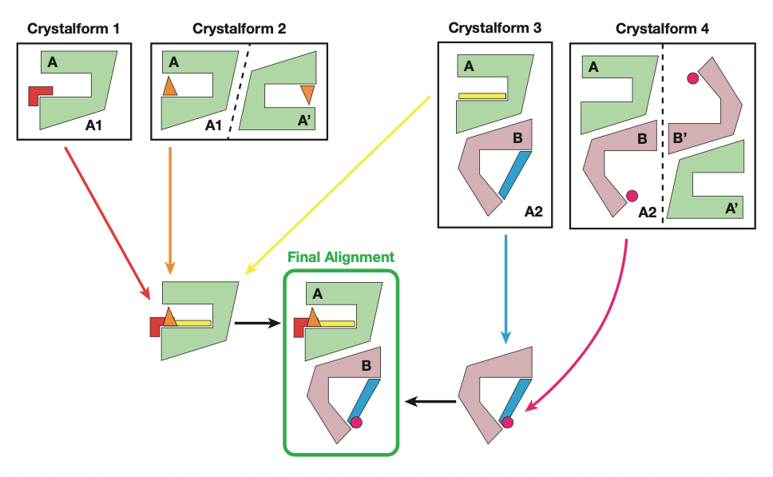
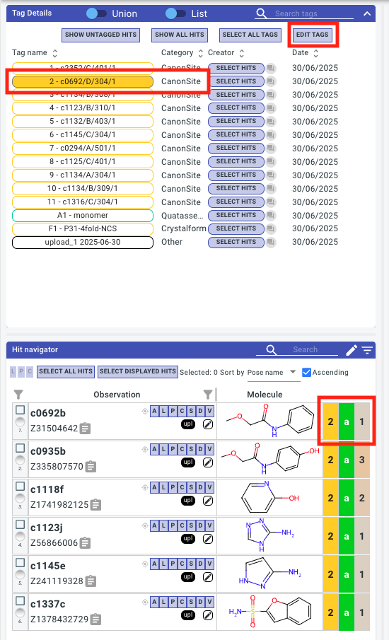
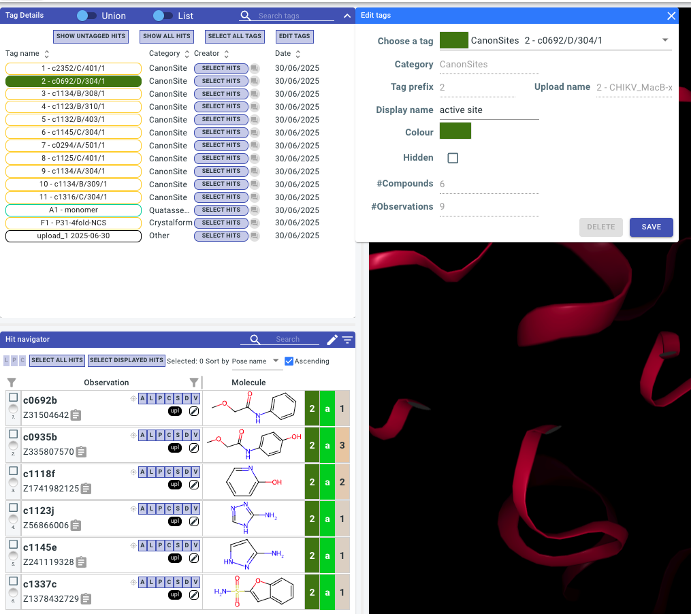
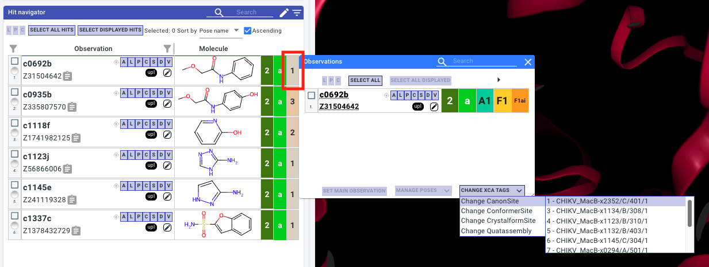
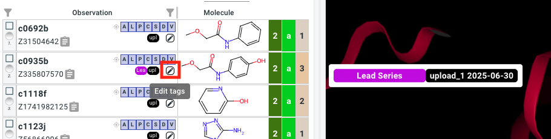
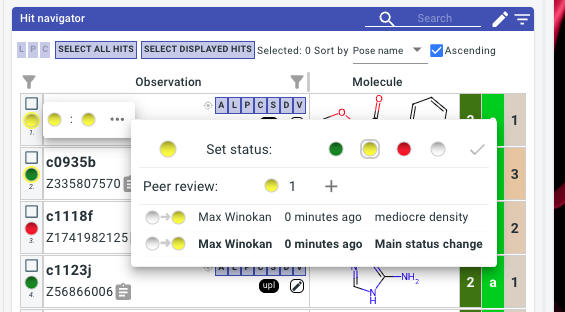

# Tagging/curating experimental (LHS) data

[XChemAlign](xchem-align.readthedocs.io) transforms crystallographic data into a biological reference frame. This involves matching ligand neighbourhoods across crystalforms, assemblies, and chains onto a appropriate reference structures. This process generates various _sites_ which make their way into Fragalysis via tags. All tag information is also included in the `metadata.csv` in any Fragalysis download.



## Working with XCA-assigned sites/tags

The main XCA-assigned site is called a _Canonical Site_ and effectively clusters ligands. When you first upload a target to Fragalysis all CanonSite tags will have an auto-generated name and colour. See CanonSite 2: `2 - c0692/D/304/1` in the screenshot below. The yellow `2` in the hit navigator corresponds to this canonical site. 



### Editing tags

The colour, name, and visibility of the site can be changed in the `Edit Tags` dialog. 



```{note}
N.B. you must be logged in and on the UAS proposal to make any changes to a Fragalysis target.
```

### Changing site assignments

If you disagree with the clustering from XCA you can change the assigned sites via the observation dialog (click on the observation count to open):



## Adding "Curator" tags

For additional annotation of structures _Curator Tags_ can be created via the `Edit Tags` window. Select `Other -- new tag --` from the dropdown. These tags can be added to observations in the tag navigator:



## Indicating merging hypotheses

For _Fast Forward Fragments_ it is required to create one _Curator Tag_ for each group of fragments that you wish to explore merging. These can often just be all hits in the pockets of interest.

## Indicating experimental / model quality

The experimental / model quality can be indicated using the traffic light system:



Each observation will have a `Main Status`, it should be decided in your project who has the final say on this, typically there is one main data owner / structural biologist. All other members are recommended to only add `Peer Reviews`. These not only have a status, but also allow for a comment.
